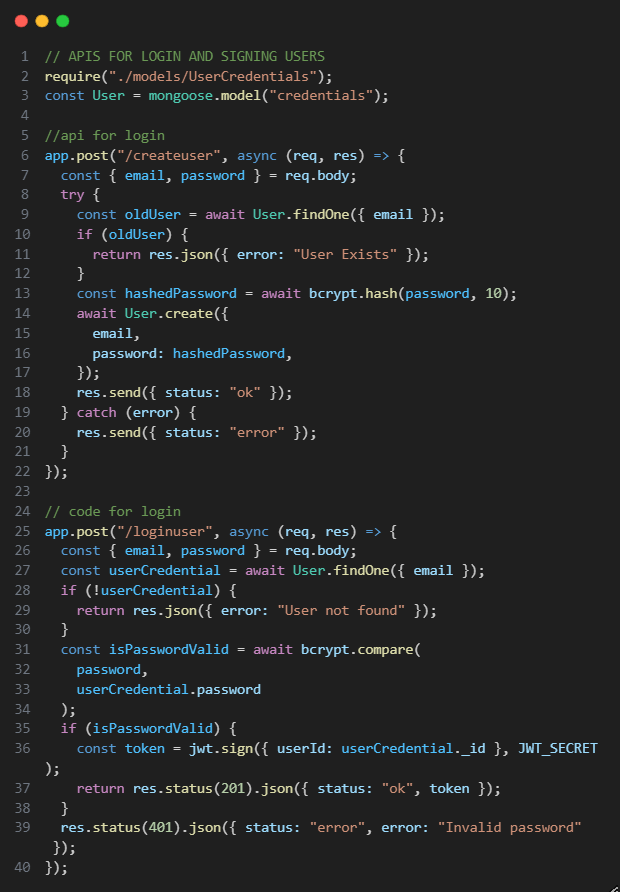
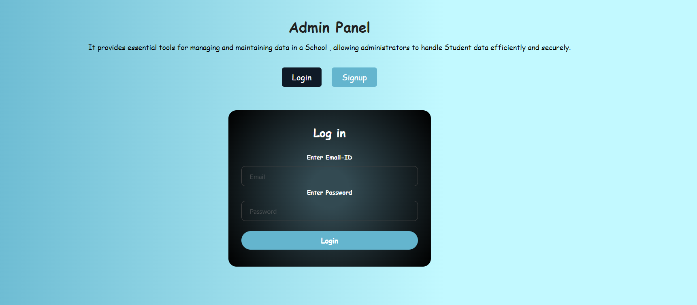
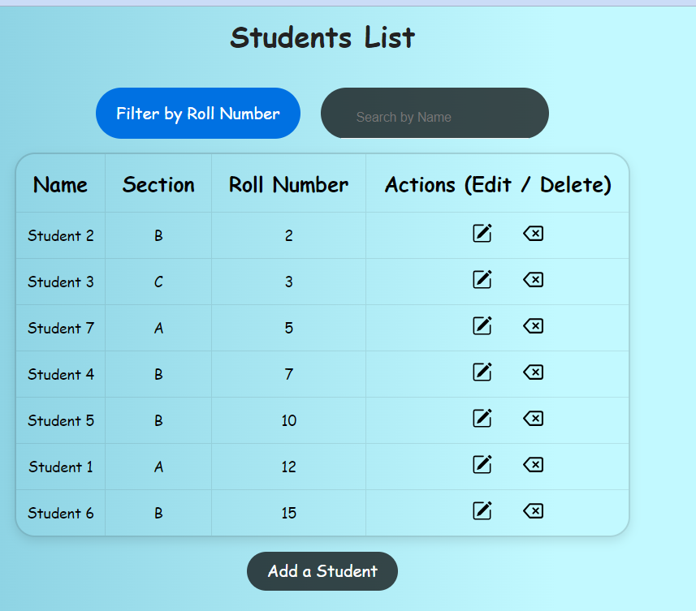
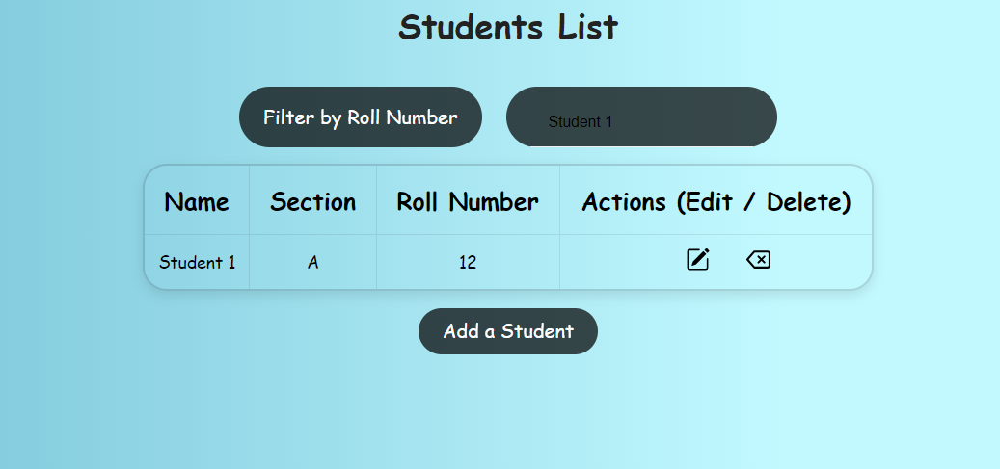
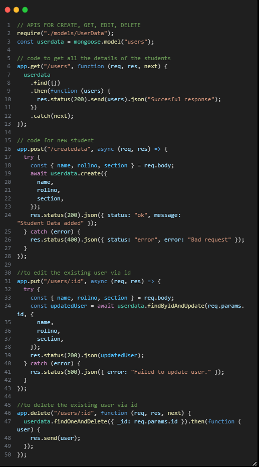
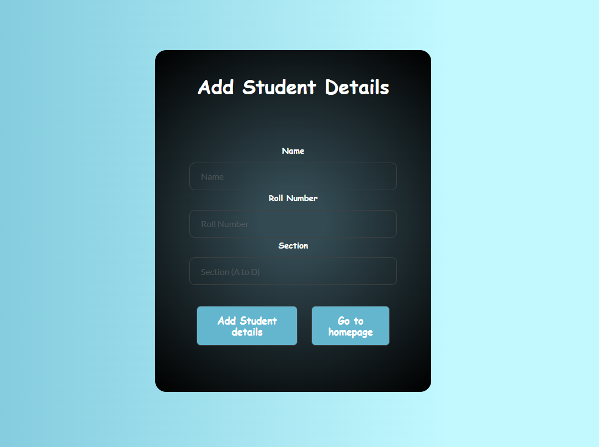
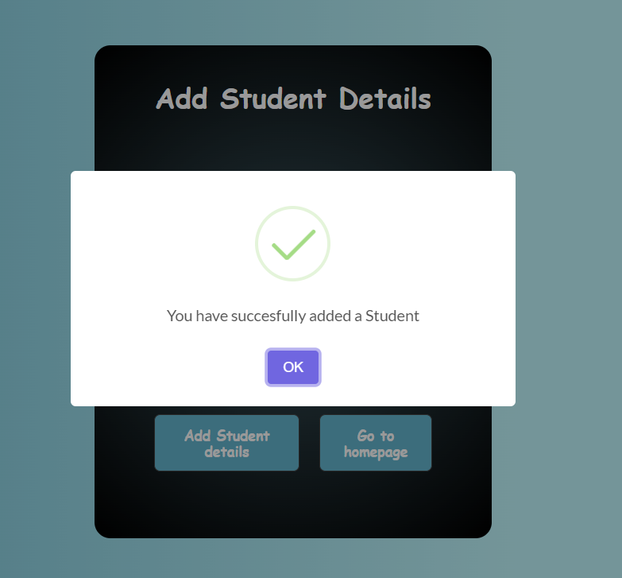
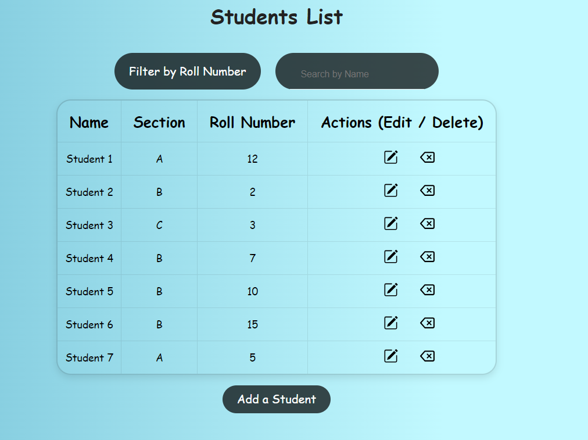

# Student Admin Panel - MERN CRUD App
The Student Admin Panel is a full-stack CRUD (Create, Read, Update, Delete) application built using the MERN stack, which includes React for the frontend, Node.js with Express for the backend, and MongoDB as the database.  This application allows administrators to manage student records .  It also includes authentication with login and signup functionality  for administrators to access the admin panel securely.

## Features
View a list of all students with their details. 
Add a new student to the database. 
Edit student information (name, roll number, section.) 
Delete a student from Database. 
Sort Students By Roll Number.  
Search Students by Name.  
Secure login and signup functionality for administrators using JSON Web Tokens (JWT).

## Technologies And Dependencies
### Frontend
React.js 
axios 
react-icons 
sweetalert2 

### Backend
Node.js 
mongodb 
cors 
bcrypt 
express 
jsonwebtoken 
mongoose 
swagger-jsdoc 
swagger-ui-express

## Installation and Setup
### Clone The Repository
git clone https://github.com/mihika14/Student-adminpanel
### Install the dependencies
cd frontend 
npm i axios react-icons sweetalert2 
cd ../backend 
npm i mongodb cors bcrypt express jsonwebtoken mongoose mongodb swagger-jsdoc swagger-ui-express 
cd ../ 
npm start

## Usage
Open your web browser and navigate to localhost to access the Student Admin Panel.

## SignUp and Login
API for SignUp and Login Page. 
 
Before accessing the admin panel, administrators need to sign up for an account. Click on the "Sign Up" Button and fill in the required information to create an account. After signing up, you can login through login form. 

## Sorting
Click on the "Filter by Roll Number" button to sort the students by their roll number. 

## Searching Students
Use the search bar at the top to search for students by their name. As you type, the list of students will be filtered to show only the students whose names match the search query.

## CRUD API (CREATING , READING , UPDATING , DELETING STUDENT'S DETAILS)

## Adding a New Student 
Click on the "Add Student" button above to open this form where you can enter the details of the new student. After filling in the required information, click the "Add Student details" button to add the student to the database.

## Updating and Deleting Student Details
Click on the "pencil" icon in actions column to edit the student inthe database.  
Click on the "cross" icon in actions column to delete the student from the database.

## API DOCUMENTATION
To Access Documentation of thr CRUD API's click on this link:- https://drive.google.com/file/d/1udwtoj48Vst_vnKbjK3-3RcQ6i2c7S7d/view?usp=sharing.  
or While Running Locally you can redirect to http://localhost:5000/api-docs/ to access documentation.

